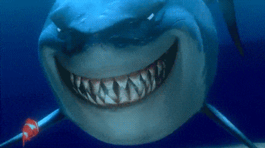

# SharkAttacks
**Vamos analisar a relação do tubarão com os seres humanos?**

### RESUMO

Ninguém quer arrumar uma briga com o "Rei dos mares", seguindo o ditado popular: "Quando um não quer, dois não brigam",
mas existe alguma forma de evitar esse confronto tão desigual? Existiria algum país com maior ocorrencia de ataques? E os ataques 
com certeza devem ser fatais, certo? Ou não? Qual as chances de escapar? E qual genero sofre mais ataques?
Algumas curiosidades sobre tubarão antes de respondermos algumas destas perguntas.

### 5 - CURIOSIDADES 🦈

1 - Um tubarão pode perder até 30 mil dentes ao longo de sua vida. Sempre que um cai, outro nasce no lugar.

2 - O tubarão é míope. 

3 - Existem cerca de 500 espécies de tubarão, mas apenas 35 já se envolveram em ataques a seres humanos.

4 - O Tubarão Branco pode viver por cerca de 70 anos.

5 - Os tubarões fazem uma espécie de "mordida-teste", que consiste em morder algo para ver se é comida. 
Se ele percebem que é diferente do que costumam comer abandonam! 

### PROCESSO 💻

Explicando um pouco do processo, basicamente na pasta .data, você poderá verificar o arquivo inicialmente tratado. 
Que é uma base de dados pública localizada no site Kaggle ("shark-attack").
Utilizando o Anaconda, com a linguagem Python3, e algumas bibliotecas, realizei uma limpeza de dataFrame, para visualizar
algumas questões das quais achei interessante.
Referente a limpeza dos dados é possível verificar o passo a passo no arquivo "shark-attack-cleaning.ipynb".
E verificar alguns gráficos retirados desses dados, no arquivo "shark-attack-analysis.ipynb".

Para uma melhor análise, voce também pode verificar a análise realiza através do Tableau que está no link abaixo:

https://public.tableau.com/views/shark-attack_16107483169850/Analise-Ataques?:language=pt&:display_count=y&publish=yes&:origin=viz_share_link

Espero que goste!

César Ribeiro
